# KAIROS MAPS — Premium Knowledge Differentiation Audit & Design

**Fase 3.8f.7** · Auditoría editorial (sin implementación)  
**Fecha:** 26 mayo 2026  
**Base:** auditoría 3.8f.6c · compositor @ `8151468` · carta lab Roberto  
**Alcance:** `premium-blocks.js`, `premium-knowledge-service.js`, capas human presence / closing / observe / challenge / integration en compositor y narrative spine — **sin atmosphere ni country**

> Objetivo: identificar **de dónde viene la clonación** entre ciudades y diseñar evolución editorial para lecturas más únicas — **sin tocar código**.

---

## I. Resumen ejecutivo

La auditoría 3.8f.6c demostró que **City Atmosphere y Country Archetype cumplen**. El cuello de botella es **contenido reutilizable** en tres capas distintas:

| Capa | Rol en clonación | Severidad |
|------|------------------|-----------|
| **Compositor editorial** (`HUMAN_EDITORIAL_PADS`, `HUMAN_TOPUP_VARIANTS`, transiciones) | Relleno 500–900 pal → frases idénticas en 12–15/15 lecturas | **Crítica** |
| **Human spine / closing** (`HUMAN_CLOSING_BY_GOAL`, `HUMAN_CONFLICT_*`, `HUMAN_ACTION_BY_GOAL`) | Plantillas fijas por goal; solo `{ciudad}` cambia | **Alta** |
| **Premium Knowledge** (`premium-blocks.js` + selector) | 74 bloques; muchos `goals: ['any']`; 1 bloque en **todas** las ciudades | **Media-alta** |

**Veredicto:** Premium Knowledge **no es el único culpable**, pero **sí domina el peso** (~75–91 % palabras). La sensación de clonación viene sobre todo de **~25 plantillas compositor + ~15 frases spine** que se superponen a bloques DOC-17/DOC-6 genéricos.

**Meta editorial propuesta:** bajar Knowledge genérico al **45–55 %**, subir Human Presence diferenciado al **20–25 %**, y reservar **20–25 %** a señales territoriales (atmosphere + country, fuera de este doc) para alcanzar **sensación premium ≥ 8,5/10** y **distintividad ciudad ≥ 8/10**.

---

## II. Diagnóstico de repetición

### II.1 Fuentes de repetición (no atmosphere / no country)

```mermaid
flowchart TD
  A[composeCityReading] --> B[getBlocksForContext]
  A --> C[Human spine narrative]
  A --> D[Compositor voice layer]
  B --> B1[premium-blocks 74 unidades]
  B --> B2[interpretations fallback]
  C --> C1[HUMAN_CLOSING_BY_GOAL]
  C --> C2[HUMAN_CONFLICT_BY_LABEL]
  C --> C3[HUMAN_ACTION_BY_GOAL]
  C --> C4[humanObserve boilerplate]
  D --> D1[HUMAN_EDITORIAL_PADS ×12]
  D --> D2[HUMAN_TOPUP_VARIANTS ×10]
  D --> D3[VOICE_TRANSITION_POOL]
  D --> D4[HUMAN_SCENE_POOL ×3/goal]
  D --> D5[SPINE_FAVORECE/APROVECHA opens]

  style D1 fill:#4a1a1a
  style C1 fill:#4a1a1a
  style B1 fill:#3a3a1a
```

### II.2 Frases repetidas — evidencia (15 lecturas piloto)

| Frase / plantilla | Fuente | Apariciones /15 |
|-------------------|--------|-----------------|
| «Con el tiempo, puede que [ciudad] confirme o matice lo que el cuerpo ya intuía» | `humanObserve` builder + `HUMAN_EDITORIAL_PADS` | **15** |
| «Un gesto pequeño puede bastarte para seguir habitando [ciudad] con verdad» | `HUMAN_EDITORIAL_PADS` | **13** |
| «Mira si lo que sientes hoy sigue vivo dentro de un mes — sin presión» | `HUMAN_EDITORIAL_PADS` | **13** |
| «Dale tiempo antes de juzgar un solo día perfecto o un roce incómodo» | `HUMAN_EDITORIAL_PADS` | **13** |
| «A veces ocurre que lo hermoso vive en la repetición tranquila…» | `HUMAN_EDITORIAL_PADS` | **11** |
| «Si algo queda contigo de [ciudad]… más verdadero antes que más visible» | `HUMAN_CLOSING_BY_GOAL.amor` | **5** (amor) + eco en integración |
| «Esta semana, atrévete a un encuentro sin disfraz…» | `HUMAN_ACTION_BY_GOAL.amor` | **5** (amor) |
| «La señal es notable pero no máxima: el lugar habla claro…» | `doc6_intensidad_linea_cercana` | **10** usos catálogo |

### II.3 Muletillas repetidas

| Muletilla | Catálogo `premium-blocks` | Lecturas compuestas (15) |
|-----------|---------------------------|--------------------------|
| **puede que** | baja | **~69** |
| **tal vez** | baja | **~54** |
| **quizá** | baja | **~40+** (spine + transiciones) |
| **gesto pequeño** | 1 bloque explícito | **16+** (pads + spine) |
| **conviene** | 6 bloques DOC-6 | moderado en texto final |
| **el lugar favorece** | 4 bloques DOC-17 | recurrente en favorece |

**Conclusión:** las muletillas **no nacen solo en premium-blocks**; el compositor las **multiplica** vía pads, transiciones y `humanizePresenceSpine()`.

### II.4 Estructuras repetidas

| Estructura | Secciones afectadas |
|------------|---------------------|
| Apertura favorece: «Quizá notes que se abre…» / «Tal vez se insinúe un gesto posible» | favorece |
| Puente: «Y ahí aparece algo distinto — sin contradecir lo anterior» | desafía |
| Acción: «En [ciudad], un gesto pequeño puede sostener lo anterior» + acción fija por goal | aprovecha |
| Observar: **[imagen]** + boilerplate temporal | observar |
| Integración: pregunta guía + **cierre clonado** + bloques país (fuera alcance) | integracion |

### II.5 Bloques intercambiables (solo nombre de ciudad)

**Ejemplos reales** de texto que sobrevive al cambio Lisboa → Tokio:

1. **`HUMAN_CLOSING_BY_GOAL.amor`** — *«Si algo queda contigo de Lisboa, que sea esto: atreverte a ser más verdadero antes que más visible.»*
2. **`HUMAN_CONFLICT_BY_LABEL['autenticidad frente a brillo']`** — *«La pregunta no es cómo destacar en Lisboa. Es cuánto de ti muestras… espejo.»* (Lisboa, Barcelona)
3. **`HUMAN_CONFLICT_BY_LABEL['aprobación frente a autenticidad']`** — *«Tal vez el roce no sea el otro, sino la distancia entre la versión que encaja…»* (Toronto, Tokio, Cabo)
4. **`doc6_intensidad_linea_cercana`** — *«La señal es notable pero no máxima: el lugar habla claro sin exigir dominar la energía al primer día…»*
5. **`doc17_sol_ac_t*`** — bloques Sol×AC con `{ciudad}` insertado; mismo contenido psicológico en Lisboa y Cabo
6. **`HUMAN_EDITORIAL_PADS[7]`** — *«Un gesto pequeño puede bastarte para seguir habitando Lisboa con verdad.»*

---

## III. Ranking de bloques problemáticos (TOP 20)

Ordenado por **impacto en clonación** (frecuencia × intercambiabilidad × visibilidad), no solo por uso en catálogo.

| # | ID / artefacto | Tipo | Problema | Ciudades | Aspectos |
|---|----------------|------|----------|----------|----------|
| 1 | **`HUMAN_EDITORIAL_PADS`** (12 plantillas) | Compositor pad | 12 frases rotativas; 8 aparecen en >10/15 lecturas | 5/5 | 3/3 |
| 2 | **`humanObserve` boilerplate** | Narrative observe | Concatena «Con el tiempo, puede que…» tras imagen | 5/5 | 3/3 |
| 3 | **`HUMAN_CLOSING_BY_GOAL.amor`** | Human closing | Cierre idéntico salvo `{ciudad}` | 5/5 | 1/3 |
| 4 | **`doc6_intensidad_linea_cercana`** | Premium block | Único bloque catálogo en **5 ciudades × 3 goals** | 5/5 | 3/3 |
| 5 | **`HUMAN_ACTION_BY_GOAL.amor`** | Human action | «Encuentro sin disfraz» en toda lectura amor | 5/5 | 1/3 |
| 6 | **`HUMAN_CONFLICT_BY_LABEL['autenticidad…']`** | Challenge spine | Espejo / destacar — Lisboa + Barcelona | 2/5 | 1/3 |
| 7 | **`HUMAN_CONFLICT_BY_LABEL['aprobación…']`** | Challenge spine | Máscara / versión que encaja | 3/5 | 1/3 |
| 8 | **`HUMAN_TOPUP_VARIANTS`** (10 plantillas) | Compositor top-up | «Ritmos honestos», «coherencia no total» | 4/5 | 3/3 |
| 9 | **`VOICE_TRANSITION_POOL.contradiccion`** | Transition | «Sin contradecir lo anterior» | 4/5 | 3/3 |
| 10 | **`HUMAN_OPPORTUNITY_PATTERNS['siendo coherente']`** | Opportunity | Performativo / coherencia | 4/5 | 2/3 |
| 11 | **`doc6_jerarquia_natal_linea`** | Synthesis | «El lugar amplifica…» — `goals: any` | 4/5 | 3/3 |
| 12 | **`doc5_no_pildora_magica`** | Challenge | «El lugar no sustituye entregables…» | 3/5 | 3/3 |
| 13 | **`HUMAN_SCENE_POOL`** (3 escenas/goal) | Observe scene | Agotamiento rápido; repite entre ciudades | 5/5 | 3/3 |
| 14 | **`SPINE_FAVORECE_OPEN`** (3 variantes) | Compositor open | Aperturas favorece predecibles | 5/5 | 3/3 |
| 15 | **`doc17_venus_ac_t2_integrated`** | Premium block | «Performar» / magnetismo — Barcelona | 1/5 | 2/3 |
| 16 | **`doc6_contradiccion_friccion_evolutiva`** | Synthesis | Metodología «bueno y malo» | 3/5 | 3/3 |
| 17 | **`interpretations.js` fallback** | Fallback | Frases Fase 1.x genéricas en huecos | 5/5 | 3/3 |
| 18 | **`HUMAN_CLOSING_BY_GOAL.trabajo`** | Human closing | Buena variante pero repetida en integración + pads | 5/5 | 1/3 |
| 19 | **`doc17_sol_ac_*` (t1–t4)** | Premium block | Mismo arco Sol×AC en Lisboa/Cabo | 2/5 | 2/3 |
| 20 | **`doc5_permanencia_gestion`** | Observe block | «Si permaneces, el lugar deja de ser escaparate…» | 2/5 | 3/3 |

---

## IV. Ranking de bloques más valiosos (TOP 15)

Bloques que **añaden distinción real** (astrología, goal, distancia, integración sombra) y deben **protegerse** en cualquier recorte editorial.

| # | ID / artefacto | Por qué es valioso |
|---|----------------|-------------------|
| 1 | **`doc17_*` integrado/sombra por planeta×ángulo** | Contenido anclado a influencia real del mapa |
| 2 | **`doc6_marte_jupiter_friccion`** | Match planetario específico |
| 3 | **`doc6_intensidad_linea_exacta`** | Solo dist < 80 km — rareza = diferenciación |
| 4 | **`doc6_objetivo_amor_dc_venus`** | Goal amor explícito |
| 5 | **`doc6_objetivo_trabajo_mc`** | Goal trabajo explícito |
| 6 | **`doc6_objetivo_descanso_ic`** | Goal descanso explícito |
| 7 | **`doc17_* t4` (acción práctica)** | Gestos concretos distintos por planeta |
| 8 | **`HUMAN_CONFLICT_BY_LABEL['visibilidad…']`** | Trabajo — prisa por ser visto (Toronto-like) |
| 9 | **`HUMAN_CONFLICT_BY_LABEL['impulso…']`** | Descanso — cuerpo vs mente |
| 10 | **`HUMAN_ACTION_BY_GOAL.trabajo`** | Acción distinta de amor (escribir en privado) |
| 11 | **`HUMAN_ACTION_BY_GOAL.descanso`** | Acción distinta (bloque refugio) |
| 12 | **`HUMAN_CLOSING_BY_GOAL.trabajo`** | Cierre distinto — señales vs hacer más |
| 13 | **`HUMAN_CLOSING_BY_GOAL.descanso`** | Cierre distinto — permiso pausa |
| 14 | **`doc17_marte_mc_*`** | Cabo trabajo — arco específico Marte×MC |
| 15 | **`doc17_venus_ac_*` (Barcelona amor)** | Bloque planeta cuando influye Venus×AC |

---

## V. Análisis por sección

Puntuación de **responsabilidad en clonación** (1 = poca, 10 = máxima) y **potencial de diferenciación** (1 = bajo, 10 = alto).

| Sección | Clonación | Potencial | Diagnóstico |
|---------|:---------:|:---------:|-------------|
| **síntesis** | 4/10 | **9/10** | Primera frase atmosphere (fuera alcance) + puente «Quizá, leyendo [ciudad] desde el [goal]…» templado |
| **favorece** | **7/10** | 6/10 | Mezcla DOC-17 valioso + oportunidad spine genérica + aperturas SPINE_FAVORECE |
| **desafía** | **10/10** | 5/10 | **100 %** párrafos con ≤1 anclaje urbano; 2 plantillas conflict dominan amor |
| **aprovechar** | **9/10** | 5/10 | Acción fija por goal + pads «gesto pequeño» + bloques t4 repetibles |
| **observar** | **8/10** | **7/10** | Imagen urbana fuerte al inicio; **destruida** por boilerplate temporal (15/15) |
| **integración** | **8/10** | 6/10 | Pregunta guía OK; cierre amor clonado; pads de top-up |

**Ratio párrafos “genéricos”** (≤1 mención ciudad, excl. síntesis): favorece 73 % · desafía **100 %** · aprovecha 87 % · observar 60 % · integración 60 %.

---

## VI. Análisis por aspecto

### VI.1 Bloques en varios aspectos (catálogo + spine)

| Artefacto | amor | trabajo | descanso |
|-----------|:----:|:-------:|:--------:|
| `doc6_intensidad_linea_cercana` | ✅ | ✅ | ✅ |
| `HUMAN_EDITORIAL_PADS` (mayoría) | ✅ | ✅ | ✅ |
| `HUMAN_CLOSING_BY_GOAL` | amor clonado | trabajo distinto | descanso distinto |
| `HUMAN_ACTION_BY_GOAL` | disfraz | escribir privado | bloque refugio |
| `HUMAN_SCENE_POOL` | 3 escenas | 3 escenas | 3 escenas |
| DOC-17 blocks | filtrados por `goals` en influencia | idem | idem |

**Hallazgo:** **amor** concentra la clonación (cierre + acción + conflict autenticidad). **Trabajo** y **descanso** tienen spine más diferenciado pero **comparten pads** compositor.

### VI.2 Distintividad por aspecto (media 5 ciudades)

| Aspecto | Distintividad | Nota |
|---------|:-------------:|------|
| **amor** | **5,5/10** | Peor: cierre + acción + conflict compartidos |
| **trabajo** | **6,5/10** | Mejor: conflict visibilidad + objetivo MC |
| **descanso** | **6,5/10** | Mejor: conflict cuerpo + acción refugio |

### VI.3 `premium-knowledge-service.js` — comportamiento relevante

| Comportamiento | Efecto en diferenciación |
|----------------|-------------------------|
| `selectDoc17Blocks` — máx. 2 influencias profundas | Bien: ancla astrología |
| `selectSynthesisBlocks` — prioriza IDs fijos + `goals: any` | Mal: empuja DOC-6 genéricos |
| Sin filtro por ciudad/región en selector | Esperado: diferenciación no es trabajo del service |
| Seed determinista `city|goal|influences` | Bien: estable; Mal: misma ciudad siempre misma mezcla |
| `getBlocksForContext` no deduplica vs spine | Riesgo: mismo tema en block + humanOpportunity |

**Conclusión service:** el selector **no es bug**; amplifica un catálogo con **16/74 bloques `goals: any`** y compositor que **rellena** hasta 500 palabras con plantillas globales.

---

## VII. Propuesta editorial de evolución

### VII.1 Principios

1. **Una lectura, una huella** — mínimo 3 frases irreemplazables entre ciudades piloto.
2. **Planet-first, template-last** — priorizar DOC-17 de influencias activas sobre DOC-6 `any`.
3. **Goal-native** — amor/trabajo/descanso no deben compartir cierre ni acción.
4. **Observe = imagen + tiempo** — separar editorialmente imagen urbana (atmosphere) de temporalidad (pads); no fusionar en un solo párrafo boilerplate.
5. **Techo de muletillas** — máx. 4 modales débiles por lectura (`puede que` + `tal vez` + `quizá`).

### VII.2 Taxonomía editorial propuesta (premium-blocks + human libraries)

| Clase | Etiqueta | Uso máximo / lectura | Acción |
|-------|----------|----------------------|--------|
| **A — Astrología situada** | `planet-angle-goal` | 40–50 % palabras | Expandir DOC-17 |
| **B — Human spine** | `spine-goal-city` | 15–20 % | Variantes ×5 por goal |
| **C — Contexto universal** | `any-territory` | ≤15 % | Retirar o racionar DOC-6 `any` |
| **D — Relleno experiencial** | `pad-global` | ≤10 % | Reducir pools compositor |
| **E — Fallback** | `interpretation` | ≤10 % | Mantener fail-soft |

### VII.3 Objetivo de mezcla (% palabras)

| Capa | Hoy (est.) | Objetivo editorial | Δ |
|------|------------|-------------------|---|
| **Premium Knowledge** (A + C catálogo) | 75–91 % | **45–55 %** | −25 pp |
| **Human Presence** (spine B + transiciones + escenas) | ~10–15 % implícito | **20–25 %** | +10 pp |
| **City Atmosphere** | 15–25 % perceptible | **20–25 %** | estable |
| **Country Archetype** | 5–10 % | **8–12 %** | +2 pp |

> Nota: atmosphere y country no se auditan aquí; se incluyen solo en **balance objetivo** de lectura final.

### VII.4 Bibliotecas a evolucionar (solo contenido)

| Biblioteca | Ubicación lógica | Acción editorial |
|------------|------------------|------------------|
| **Cierres humanos** | `HUMAN_CLOSING_BY_GOAL` | 5 variantes × 3 goals; retirar frase única amor |
| **Conflictos** | `HUMAN_CONFLICT_BY_LABEL` | +3 labels; menos reutilización cruzada amor |
| **Acciones** | `HUMAN_ACTION_BY_GOAL` | 5 acciones rotativas por goal |
| **Observe temporal** | `HUMAN_OBSERVE_BY_GOAL` + boilerplate | Desacoplar de imagen atmosphere |
| **Pads compositor** | `HUMAN_EDITORIAL_PADS` | De 12 → 36 frases; tag `territory-agnostic` |
| **Premium blocks** | `premium-blocks.js` | Retirar o marcar `any` los 7 methodology blocks |
| **DOC-17** | ampliar piloto | Más planet×angle; menos texto `{ciudad}` genérico |

---

## VIII. Quick wins (alto impacto, bajo esfuerzo editorial)

| # | Acción | Impacto esperado | Esfuerzo |
|---|--------|------------------|----------|
| 1 | **Retirar o reescribir** `HUMAN_CLOSING_BY_GOAL.amor` (5 variantes) | −1 frase clonada en 5/5 ciudades amor | Bajo |
| 2 | **Reescribir boilerplate observe** «Con el tiempo, puede que… confirme o matice…» (3 variantes por goal) | −15/15 repetición exacta | Bajo |
| 3 | **Congelar `doc6_intensidad_linea_cercana`** salvo dist > 200 km explícita | −1 bloque universal | Bajo |
| 4 | **Ampliar `HUMAN_ACTION_BY_GOAL.amor`** a 5 acciones (eliminar solo «sin disfraz») | Distintividad aspecto amor +2 | Bajo |
| 5 | **Etiquetar bloques `goals: any`** como clase C — cuota máx. 2 por lectura | −metodología en texto | Medio |
| 6 | **Duplicar `HUMAN_SCENE_POOL`** a 9 escenas/goal | −repetición observar | Bajo |
| 7 | **Reescribir 12 `HUMAN_EDITORIAL_PADS`** eliminando top-5 frases 3.8f.6c | −60 % clonación transversal | Medio |
| 8 | **Separar conflict amor** en 2 labels (brillo vs intimidad) | Lisboa ≠ Barcelona | Medio |

---

## IX. Riesgos

| Riesgo | Probabilidad | Impacto | Mitigación editorial |
|--------|--------------|---------|------------------------|
| Lecturas < 500 palabras al recortar pads | Media | Alto | Sustituir pads por DOC-17, no vacío |
| Pérdida voz KAIROS uniforme | Media | Medio | Mantener conectores limitados (1 pool reducido) |
| Sobrecarga DOC-17 sin curación | Alta | Medio | Piloto 10 influencias más frecuentes |
| Amor más débil que trabajo/descanso | Baja | Alto | Priorizar quick wins amor |
| Ciudades sin atmosphere suficiente | Baja | Medio | Clase C solo si A+B < 450 palabras |
| Regresión smokes voice | Media | Medio | Gate anti-dogma + anti-clonación en QA |

---

## X. Recomendación de roadmap editorial

| Fase | Nombre | Entregable | Dependencia |
|------|--------|------------|-------------|
| **3.8f.7a** | **Cierres y acciones** | `HUMAN_CLOSING_*` + `HUMAN_ACTION_*` ampliados (doc voice) | Ninguna |
| **3.8f.7b** | **Observe split** | Biblioteca observe: imagen vs temporal (doc voice) | 3.8f.7a |
| **3.8f.7c** | **Catálogo premium-blocks v2** | Taxonomía A–E; retirar/racionar `any`; +20 bloques DOC-17 | 3.8f.7a |
| **3.8f.7d** | **Pads compositor v2** | Reescritura `HUMAN_EDITORIAL_PADS` + `TOPUP` (doc voice) | 3.8f.7b |
| **3.8f.7e** | **QA clonación** | Checklist: 0 frases idénticas entre 5 ciudades; ≤4 modales | 3.8f.7c–d |
| **3.8f.7f** | **Re-audit 3.8f.6c+** | Repetir scoring distintividad; target ≥8 ciudad | 3.8f.7e |

**Orden recomendado:** 7a → 7b → 7c → 7d → 7e → 7f. **No requiere cambio de compositor** para 7a–7c (solo contenido en bibliotecas voice y blocks). Fases 7d implican **texto embebido en compositor** — acordar si entra como contenido externalizado en fase posterior.

---

## Anexo A — Tabla ciudad × fortalezas × debilidades (capa knowledge/human)

| Ciudad | Fortalezas (knowledge/human) | Debilidades (knowledge/human) |
|--------|------------------------------|-------------------------------|
| **Lisboa** | Conflict autenticidad/espejo memorable; Sol×AC blocks coherentes | Comparte Sol×AC con Cabo; cierre amor clonado; pads masivos |
| **Toronto** | Conflict visibilidad/trabajo; cierre trabajo usable | Pads invierno-adjacentes compiten con blocks; «coherencia performativa» genérica |
| **Barcelona** | Venus×AC blocks ricos en amor | Conflict idéntico a Lisboa; muchos blocks Barcelona-only pero pads globales dominan |
| **Tokio** | Alto % premium blocks; mínimo fallback | Pocos blocks únicos en catálogo; conflict «máscara» compartido; sensación Japón > Tokio |
| **Ciudad del Cabo** | Marte×MC en trabajo; conflict cuerpo | Sol×AC = Lisboa; pads «brújula» / «un mes» iguales a todas |

---

## Anexo B — Puntuación objetivo post-7x (proyección editorial)

| Métrica | 3.8f.6c hoy | Objetivo 3.8f.7f |
|---------|:-----------:|:----------------:|
| Distintividad ciudad | 6,6 | **8,0** |
| Distintividad país | 6,6 | 7,0 *(country doc aparte)* |
| Distintividad aspecto | 6,4 | **7,5** |
| Sensación premium | 7,2 | **8,5** |

---

## Referencias

| Artefacto | Rol |
|-----------|-----|
| `src/content/premium-blocks.js` | 74 bloques; 11 synthesis; DOC-17 piloto |
| `src/services/premium-knowledge-service.js` | Selección determinista por goal + influencias |
| `src/services/city-premium-composition-service.js` | Pads, top-up, transiciones, human presence apply |
| `src/services/narrative-intelligence-service.js` | `HUMAN_CLOSING_*`, `HUMAN_CONFLICT_*`, observe boilerplate |
| `docs/architecture/PREMIUM_READING_PRODUCT_AUDIT.md` | Auditoría 3.8g.0 |
| Simulación 15 lecturas | `.cache/editorial-audit-readings.json` (generación local audit) |

---

## Nota de fase 3.8f.7a — Human Spine Variation P0 (implementado)

**Alcance:** `narrative-intelligence-service.js` (cierres, observe, acciones amor, cola atmósfera) + `city-premium-composition-service.js` (pads editoriales 32 por goal) + `scripts/dev-premium-editorial-variation-smoke.sh`.

**Métricas 15 lecturas piloto (Roberto, 5 ciudades × 3 goals) post-7a:**

| Métrica | Baseline 3.8f.7 | Post 3.8f.7a |
|---------|:---------------:|:------------:|
| «Con el tiempo, puede que… cuerpo ya intuía» | 15/15 | **0/15** |
| Cierre amor idéntico | 5/5 | **0/5** (maxRepeat cierre=1) |
| Acción amor «encuentro sin disfraz» | 5/5 | **0/5** (3 variantes únicas) |
| «puede que» (total lectura) | ~69 | **28** (−59%) |
| «tal vez» (total lectura) | ~54 | **33** (−39%) |
| Pads legacy («gesto pequeño…», etc.) | 13/15 | **0/15** |

**Smoke:** `./scripts/dev-premium-editorial-variation-smoke.sh` ALL PASS; gates 3.8f.4 / country / narrative / UI beta intactos.

*Auditoría editorial · Fase 3.8f.7 · Sin código · Sin commit · Sin deploy*
