# KAIROS MAPS — Premium Reading Product Audit

**Fase 3.8g.0** · Auditoría producto (sin implementación)  
**Fecha:** 26 mayo 2026  
**Estado:** diagnóstico · no desplegado · premium DEV no cableado en UI

> Objetivo: describir **exactamente** qué lectura premium existe hoy en DEV y qué falta para que un usuario final la vea — **antes** de tocar `app.js`, `index.html` producto o deploy.

---

## I. Resumen ejecutivo

| Capa | ¿Existe en código? | ¿Carga producto? | ¿Usuario lo ve? |
|------|-------------------|------------------|-----------------|
| Mapa + líneas (`astro.js`) | ✅ | ✅ | ✅ |
| Bridge natal → mapa | ✅ | ✅ | ✅ (prioriza scorer) |
| Goals + city suggestions | ✅ | ✅ | ✅ |
| **`interpretations.js`** (Fase 1.x) | ✅ | ✅ | ✅ **← lectura visible hoy** |
| Narrative Intelligence (3.8f.6) | ✅ | ❌ | ❌ |
| City Atmosphere (5 ciudades) | ✅ | ❌ | ❌ |
| Country Archetype (10 países) | ✅ | ❌ | ❌ |
| Premium Knowledge | ✅ | ❌ | ❌ |
| **City Premium Composition** | ✅ | ❌ | ❌ |
| Relocation premium | ✅ DEV | ❌ | ❌ (teaser «Próximamente») |

**Conclusión:** el usuario final recibe una **lectura popup por línea planetaria** (~Fase 1.x). La **lectura premium compuesta** (500–900 palabras, 6 secciones, atmosphere + país) existe solo en **`src/dev/*-preview.html`**.

---

## II. Diagrama actual — flujo producto visible

```mermaid
flowchart TD
  A[Onboarding] --> B[Perfil: nombre + nacimiento + goal]
  B --> C[Calcular mapa WASM/líneas]
  C --> D[Mapa Leaflet + 27 ciudades oro]
  D --> E{Usuario elige ciudad}
  E -->|click marcador / búsqueda / sugerencia| F[openInterpretation]
  F --> G[rankInfluences via Bridge + Goal + Scorer]
  G --> H{¿Líneas a menos de PROX_KM?}
  H -->|No| I[Panel: ZONA NEUTRA]
  H -->|Sí| J[Por cada influencia activa]
  J --> K[INTERPRETATIONS planeta_ángulo]
  K --> L[aspect: amor / trabajo / descanso]
  L --> M[Panel interp-panel<br/>Lectura del lugar]
  M --> N[~4 bloques por línea<br/>favorece / desafía / aprovecha / cierre]

  style M fill:#1a3a2a
  style K fill:#1a3a2a
  style N fill:#1a3a2a
```



### Scripts cargados en `src/index.html` (producto)

```
astronomy-engine → natal-engine-loader → chart-service
→ interpretations.js          ← lectura visible
→ natal-lite.js → natal-composition-service.js
→ goal-signal.js → cities-catalog.js → city-summary-templates.js
→ city-scorer.js → natal-map-bridge-service.js
→ astro.js → places.js → profile.js → onboarding.js
→ planet-glyphs.js → natal-panel.js → app.js
```

**No cargados en producto:**

- `premium-blocks.js`
- `country-archetypes.js` / `country-archetype-service.js`
- `narrative-intelligence-service.js`
- `premium-knowledge-service.js`
- `city-premium-composition-service.js`

---

## III. Diagrama objetivo — lectura premium 3.8f.6 en producto

```mermaid
flowchart TD
  A[Usuario elige ciudad + goal activo] --> B[rankInfluences — sin cambio]
  B --> C[deriveNarrativeContext]
  C --> C1[cityAtmosphere 5 ciudades]
  C --> C2[countryContext 10 países]
  C --> C3[spine humanizado]
  C --> D[getBlocksForContext]
  D --> E[composeCityReading]
  E --> F[Lectura única 500–900 palabras]
  F --> G[6 secciones: sintesis, favorece, desafia, aprovecha, observar, integracion]
  G --> H[UI producto: panel lectura premium]

  style F fill:#2a3a1a
  style H fill:#2a3a1a
```



**Diferencia estructural:** de **N lecturas por línea** (popup) → **1 lectura compuesta** por ciudad+goal, con capas atmosphere/país tejidas en spine y composición.

---

## IV. Respuestas auditadas

### 1. ¿Cuál es hoy el flujo real del usuario?

1. **Onboarding** (5 pasos): nombre, nacimiento, goal (6 opciones: amor, trabajo, descanso, profesión, cambio, viaje).
2. **Entrada al mapa:** sidebar workspace (Mapa / Carta natal / módulos bloqueados).
3. **Cálculo carta:** `KairosChartService` + WASM lazy → `computeAllLines()` → 40 líneas en mapa.
4. **Bridge:** `KairosNatalMapBridge.buildBridge()` — prioriza líneas según tags/themes natal lite + goal.
5. **Orientación goal:** chip «Mapa orientado a…» + sugerencias top-3 ciudades (scorer).
6. **Selección ciudad:** click marcador oro, búsqueda local/Nominatim, o chip sugerencia → `gotoCity()` → `openInterpretation(city)`.
7. **Panel «Lectura del lugar»:** tabs Amor / Trabajo / Descanso (3 aspectos; goal onboarding mapeado vía `mapGoalToAspect`).
8. **Render:** por cada línea dentro de `PROX_KM` (~500 km), lookup `INTERPRETATIONS[PLANETA_ANGULO][aspect]` → HTML en `#interp-body`.

**No hay paso** que invoque `composeCityReading()` ni abra preview DEV.

---

### 2. ¿Qué lectura ve realmente?

| Dimensión | Producto hoy |
|-----------|--------------|
| **Fuente** | `src/content/interpretations.js` — 40 claves planeta×ángulo |
| **Granularidad** | **Una lectura por influencia** (cada línea cercana) |
| **Estructura** | 4 bloques expandibles: favorece / desafía / aprovecha / cierre (si `expanded: true`) |
| **Longitud** | ~150–400 palabras **por línea**, no total compuesto |
| **Goal** | Tab activo (`state.activeAspect`) — 3 aspectos UI |
| **Ciudad** | Solo sustitución `{ciudad}` en plantillas |
| **Bridge** | Indirecto — ordena/scorea influencias, no altera texto |
| **Atmosphere / país** | **Ausente** |
| **Voz** | Fase 1.x — evocadora pero genérica, repetible entre ciudades |

**Ejemplo mental:** Lisboa + Luna AC + tab Amor → bloque `LUNA_AC.amor` con «En Lisboa…» — **no** la lectura de 527 palabras del lab con atmosphere Portugal + spine narrative.

---

### 3. ¿Qué capas premium existen pero no se muestran?

| Capa | Servicio / artefacto | Qué aportaría | Dónde vive hoy |
|------|---------------------|---------------|----------------|
| **Narrative Intelligence** | `narrative-intelligence-service.js` | Spine: theme, conflict, opportunity, human voice, guiding question | DEV + compositor |
| **City Atmosphere** | `CITY_ATMOSPHERE_INDEX` (5 ciudades) | Ritmo, vínculo, trabajo, descanso, éxito, imágenes urbanas | DEV + narrative |
| **Country Archetype** | `country-archetypes.js` + service | Matiz país (10 curados), máx. 2 líneas | DEV + narrative + compositor |
| **Premium Knowledge** | `premium-knowledge-service.js` + `premium-blocks.js` | 74 bloques DOC-17 filtrados por contexto | DEV + compositor |
| **Human presence** | en compositor + narrative | Voz experiencial, anti-clínico | DEV compositor |
| **City Premium Composition** | `city-premium-composition-service.js` | Lectura 500–900 pal, 6 secciones, meta completa | **Solo previews DEV** |
| **zodiacSignature / successTone** | metadata 3.8f.6 | Firma territorial ponderada (no dogma) | metadata — no UI |
| **Relocation premium** | `relocation-profile-service.js` etc. | Carta en destino | preview DEV; producto teaser |

**Previews DEV que sí muestran todo:**

- `src/dev/city-premium-preview.html` — lectura completa + country panel
- `src/dev/narrative-intelligence-preview.html` — spine + atmosphere + zodiac
- `src/dev/country-archetype-preview.html`
- `src/dev/relocation-preview.html`

---

### 4. ¿Qué diferencia habría entre lectura actual y lectura 3.8f.6?

| Aspecto | Producto (Fase 1.x) | Premium DEV (3.8f.6) |
|---------|---------------------|----------------------|
| **Unidad de lectura** | N bloques (1 por línea) | 1 lectura compuesta |
| **Palabras** | Variable, por línea | 500–900 total |
| **Secciones** | favorece/desafía/aprovecha por línea | 6 secciones globales |
| **Ciudad** | `{ciudad}` genérico | Atmosphere curada (5 ciudades) o fail-soft |
| **País** | No | Hasta 2 líneas país deduplicadas |
| **Narrative spine** | No | humanTheme, conflict, observe, closing |
| **Bloques premium** | No | ~70–85% wordShare premium blocks |
| **Fallback** | 100% interpretations | interpretations como fallback parcial |
| **Determinismo** | Estable por clave | Seed ciudad+goal+influencias |
| **Barcelona / Tokio** | Mismo template que cualquier ciudad | Atmosphere urbana propia |
| **Metadata** | Ninguna | countryLinesUsed, atmosphereLinesUsed, etc. |

**Experiencia usuario:** pasar de «informe astrocartográfico por planeta» a «ensayo personal situado en la ciudad» con matiz territorial.

---

### 5. ¿Qué archivos habría que tocar para exponer la lectura premium?

#### Imprescindibles (mínimo viable)

| Archivo | Cambio |
|---------|--------|
| **`src/index.html`** | Añadir `<script>` de: `premium-blocks.js`, `country-archetypes.js`, `country-archetype-service.js`, `narrative-intelligence-service.js`, `premium-knowledge-service.js`, `city-premium-composition-service.js` |
| **`src/ui/app.js`** | En `openInterpretation` / `renderInterpretation`: llamar `composeCityReading()`; renderizar `reading.sections` en panel |
| **`src/ui/styles.css`** | Estilos lectura larga: 6 secciones, tipografía premium, scroll |

#### Probables (UX completa)

| Archivo | Cambio |
|---------|--------|
| **`src/ui/app.js`** | Pasar `bridgeProfile`, `profile`, `relevantInfluences` ranked; fail-soft si compositor falla → fallback Fase 1.x |
| **`src/index.html`** | Panel UI: toggle «Lectura clásica / Lectura profunda» o reemplazo directo; botón mobile «Lectura» ya existe |
| **`src/ui/profile.js`** | Alinear goal onboarding (6 goals) con `resolveGoalId` compositor (3 + mapeo) |

#### Opcionales (fases posteriores)

| Archivo | Cambio |
|---------|--------|
| `src/content/city-summary-templates.js` | Integrar snippets cortos en popup |
| `src/dev/*` | No tocar producto — mantener lab |
| `dist/` | Solo en 3.8f.5b deploy staging |

#### NO tocar en primera integración (salvo aprobación)

- `src/engines/astro.js`
- `src/content/city-scorer.js` (core math)
- `src/content/interpretations.js` (mantener fallback)
- Firebase / motores WASM

---

### 6. Riesgos de integración

| Riesgo | Severidad | Detalle |
|--------|-----------|---------|
| **Carga scripts (+6 archivos)** | Media | ~+100–200 KB JS; orden de dependencias estricto |
| **Longitud lectura en mobile** | Alta | 500–900 palabras en panel lateral estrecho |
| **Tiempo composición** | Media | Síncrono en main thread; posible spinner |
| **Goal mismatch** | Media | Onboarding 6 goals vs compositor 3 (`profesion`→?) |
| **Ciudad sin atmosphere** | Baja | Fail-soft OK; lectura premium sin matiz urbano |
| **País no curado** | Baja | Fail-soft; Kenia etc. sin country lines |
| **Regresión Fase 1.x** | Alta | Usuarios acostumbrados a lectura por línea |
| **Doble fuente verdad** | Media | interpretations + premium — mantener fallback claro |
| **Staging desfasado** | Alta | Producto local ≠ staging hasta 3.8f.5b |
| **Smokes ≠ UI** | Media | PASS en node no garantiza UX; probar manual |
| **WASM + premium JS** | Baja | Cold start ya gestionado; premium no añade WASM |

---

### 7. Estrategia recomendada

**No cablear premium de golpe en producción.** Secuencia de bajo riesgo:

1. **3.8g.0** — Este audit ✅  
2. **3.8g.1** — Plan de integración UI detallado (ver § VI)  
3. **3.8g.2** — Implementación DEV detrás de flag (`?premium=1` o perfil beta)  
4. **3.8g.3** — Fallback dual: premium OK → compositor; fail → interpretations actuales  
5. **3.8f.5b** — Deploy staging para QA externo  
6. **3.8g.4** — Activación producto tras QA staging  

---

## V. Gap analysis

| # | Gap | Estado actual | Objetivo | Esfuerzo |
|---|-----|---------------|----------|----------|
| G1 | **Compositor no invocado** | `app.js` no referencia `KairosCityPremiumComposition` | Llamada en `renderInterpretation` | Medio |
| G2 | **Scripts premium no cargados** | 6 archivos ausentes en `index.html` | Añadir en orden correcto | Bajo |
| G3 | **UI para lectura larga** | Panel diseñado para bloques cortos por línea | Layout 6 secciones + scroll | Medio |
| G4 | **Una vs N lecturas** | Modelo mental «por planeta» | Una lectura integrada | Alto (UX) |
| G5 | **Atmosphere invisible** | 5 ciudades curadas solo DEV | Usuario ve matiz urbano en texto | Bajo (ya en compositor) |
| G6 | **Country invisible** | 10 países en compositor | Usuario ve matiz país (≤2 líneas) | Bajo |
| G7 | **successTone / zodiac** | Solo metadata | Opcional: panel debug o oculto | Bajo |
| G8 | **Goal 6 vs 3** | Profesión/cambio/viaje mapeados a aspect | Documentar mapeo explícito | Bajo |
| G9 | **Mobile lectura** | `mobile-lectura-btn` abre panel corto | Adaptar lectura larga | Medio |
| G10 | **Staging** | dist/ desactualizado | Sync antes de validación externa | Medio (3.8f.5b) |
| G11 | **Tests UI** | Smokes node-only | Checklist manual + snapshot | Medio |
| G12 | **Fallback** | Sin premium → nada | Degradar a interpretations.js | Medio |

---

## VI. Propuesta 3.8g.1 — Premium UI Integration Plan

**Fase siguiente recomendada** (doc + wireframe lógico, aún sin cableado producto salvo aprobación explícita de 3.8g.2).

### 6.1 Entregables 3.8g.1

| # | Entregable | Contenido |
|---|------------|-----------|
| 1 | **`PREMIUM_UI_INTEGRATION_PLAN.md`** | Especificación wireframe + flujo UX |
| 2 | **Matriz de carga scripts** | Orden, tamaño, dependencias |
| 3 | **Contrato `composeCityReading` → DOM** | Mapping `sections[]` → HTML/CSS |
| 4 | **Política fallback** | Cuándo mostrar Fase 1.x vs premium |
| 5 | **Matriz goals** | 6 onboarding → 3 compositor |
| 6 | **Checklist QA manual** | 5 ciudades × 3 goals × mobile/desktop |
| 7 | **Estimación fases** | 3.8g.2 → 3.8g.4 |

### 6.2 Decisiones UX a cerrar en 3.8g.1

| Decisión | Opciones |
|----------|----------|
| **Reemplazo vs dual** | A) Solo premium · B) Toggle clásico/profundo · C) Premium default + «ver por planeta» |
| **Ubicación** | Panel lateral actual vs modal fullscreen vs workspace «Lectura» |
| **Tabs aspect** | Mantener 3 tabs (re-componer al cambiar) vs goal fijo del perfil |
| **Loading** | Spinner en panel vs skeleton |
| **Ciudades sin atmosphere** | Misma UI con badge «lectura general» vs mensaje |
| **Mobile** | Scroll infinito vs secciones colapsables |

### 6.3 Pseudocódigo integración (referencia — no implementar en 3.8g.1)

```javascript
// app.js — renderInterpretation (futuro 3.8g.2)
const ranked = Scorer.rankInfluences(city, buildCityScorerInput());
const bridgeProfile = state.bridge.bridgeProfile; // desde buildBridge
const reading = window.KairosCityPremiumComposition.composeCityReading({
  city,
  goal: state.goalContext.primary.id,
  relevantInfluences: ranked.slice(0, 5),
  bridgeProfile,
  profile: { firstName: profile.displayName }
});
if (reading.ok) {
  renderPremiumReading(reading); // 6 secciones
} else {
  renderClassicInterpretations(city); // Fase 1.x actual
}
```

### 6.4 Criterios de éxito 3.8g.x

- [ ] Usuario ve lectura 500–900 palabras al abrir ciudad curada
- [ ] Lisboa ≠ Barcelona ≠ Tokio perceptible en texto
- [ ] Fail-soft: ciudad/país desconocido → lectura sin error
- [ ] Fallback a interpretations si compositor falla
- [ ] 4 smokes gate siguen PASS
- [ ] Mobile usable (scroll, cierre panel)
- [ ] Sin regresión mapa / scorer / onboarding

---

## VII. Mapa servicios — quién llama a quién

```
PRODUCTO HOY:
  app.js → city-scorer.js → natal-map-bridge-service.js
         → interpretations.js

DEV PREMIUM (previews):
  preview → city-scorer.js → natal-map-bridge-service.js
          → narrative-intelligence-service.js
               ├─ city-atmosphere (5)
               └─ country-archetype-service.js (10)
          → premium-knowledge-service.js → premium-blocks.js
          → city-premium-composition-service.js
               └─ (fallback) interpretations.js
```

**Bridge services en producto:** `natal-map-bridge-service.js` ya alimenta scorer — **reutilizable** sin cambio para premium. Falta pasar `bridgeProfile` a compositor (previews ya lo hacen).

---

## VIII. Referencias

| Artefacto | Rol |
|-----------|-----|
| `src/ui/app.js` | `openInterpretation`, `renderInterpretation` |
| `src/index.html` | Scripts producto |
| `src/content/interpretations.js` | Lectura visible Fase 1.x |
| `src/services/city-premium-composition-service.js` | Compositor premium |
| `src/services/narrative-intelligence-service.js` | Spine + atmosphere + country |
| `src/dev/city-premium-preview.html` | Referencia UX objetivo |
| `KAIROS_CURRENT_CHECKPOINT.md` | Estado post-3.8f.6 |

---

*Auditoría producto · Fase 3.8g.0 · Sin código · Sin commit · Sin push · Sin deploy*
