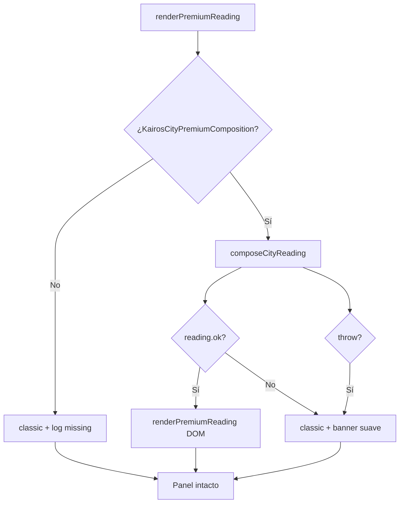

# KAIROS MAPS — Premium UI Integration Plan

**Fase 3.8g.1** · Diseño de integración (sin implementación)  
**Fecha:** 26 mayo 2026  
**Base:** auditoría `PREMIUM_READING_PRODUCT_AUDIT.md` (commit `79a5662`)  
**Estado:** plan aprobable · **no cableado** hasta 3.8g.2+

> Objetivo: definir **exactamente** cómo integrar la lectura premium DEV en la app principal — UX, arquitectura, contrato DOM, fallback, mobile y fases — **sin tocar** `app.js`, `index.html`, `styles.css` ni `dist/`.

---

## I. Resumen ejecutivo

| Dimensión | Decisión propuesta |
|-----------|-------------------|
| **UX principal** | **Opción D** — lectura rápida (actual) + lectura profunda (premium) en el mismo panel |
| **Entrada 3.8g.2** | Variante **B** — botón beta «Lectura profunda» detrás de flag (`?premium=1` o `localStorage`) |
| **Ubicación** | Panel lateral `#interp-panel` existente (desktop) · hoja `mobileMode=lectura` (mobile) |
| **Compositor** | `KairosCityPremiumComposition.composeCityReading()` |
| **Fallback** | Si `reading.ok === false` → `renderClassicInterpretations()` sin romper panel |
| **Monetización** | Diferida a **3.8g.6** — beta 3.8g.2–3.8g.5 = acceso libre para QA |

---

## II. Decisión UX principal

### 2.1 Comparativa de opciones

| Opción | Descripción | Ventajas | Riesgos |
|--------|-------------|----------|---------|
| **A — Reemplazar** | Al abrir ciudad, solo lectura premium 500–900 pal | Experiencia única; alinea producto con DEV | Regresión alta; usuarios pierden lectura por planeta; fallos premium = pantalla vacía si fallback mal hecho |
| **B — Botón «Ver lectura premium»** | Classic default; botón explícito abre premium | Bajo riesgo; ideal para beta 3.8g.2; rollback trivial | Premium oculto; descubrimiento bajo; dos clics |
| **C — Teaser + bloque premium** | Primeras ~120 pal visibles; resto «desbloquear» | Modelo freemium claro | Requiere infra pago/cuenta (no existe); tono comercial; frustra en beta |
| **D — Rápida + profunda** | Segmented control o tabs: «Por influencias» / «Lectura profunda» | Preserva Fase 1.x; premium opt-in; un solo panel | Más UI; recomposición al cambiar modo; tabs aspect × modo = complejidad |

### 2.2 Recomendación: **Opción D** (objetivo producto)

**Por qué D y no A:** la auditoría 3.8g.0 confirma que el usuario actual espera **bloques por línea planetaria** con fuerza/distancia. Eliminarlo de golpe rompe el modelo mental y dificulta QA comparativo.

**Por qué D y no C:** no hay capa de suscripción, Stripe ni cuenta. Un paywall visual antes de 3.8g.6 generaría fricción sin valor.

**Por qué D y no solo B:** B es el **camino de entrada seguro** en 3.8g.2 (un botón beta), pero el estado final debe ser un **conmutador persistente** dentro del panel — no un botón escondido.

**Implementación UX concreta (D):**

```
┌─────────────────────────────────────────┐
│ Lectura del lugar · Lisboa              │
│ [ Por influencias ] [ Lectura profunda ]│  ← segmented control (nuevo)
│ ♥ Amor  ◆ Trabajo  ☾ Descanso           │  ← tabs existentes (ambos modos)
├─────────────────────────────────────────┤
│  (contenido según modo + aspect activo) │
└─────────────────────────────────────────┘
```

- **Default al abrir ciudad:** modo «Por influencias» (comportamiento actual).
- **Modo «Lectura profunda»:** una sola lectura compuesta; tabs re-componen con `composeCityReading({ goal: aspect })`.
- **Persistencia:** `sessionStorage.kairosReadingMode` (`classic` | `deep`) — no localStorage permanente en v1.
- **Beta 3.8g.2:** solo mostrar segmented control si `premiumBetaEnabled()`; si no, panel clásico intacto.

---

## III. Flujo de usuario propuesto

### 3.1 Diagrama objetivo

```mermaid
flowchart TD
  A[Onboarding 5 pasos] --> B[Perfil + goal guardado]
  B --> C[Workspace Mapa]
  C --> D[WASM lazy + 40 líneas]
  D --> E[Bridge + GoalSignal + Scorer]
  E --> F[Chip goal + top-3 sugerencias]
  F --> G{Usuario elige ciudad}
  G -->|marcador / búsqueda / chip| H[gotoCity + openInterpretation]
  H --> I[Panel interp-panel abierto]
  I --> J{Modo lectura}
  J -->|Por influencias| K[renderClassicInterpretations]
  J -->|Lectura profunda| L{¿premiumBeta + scripts OK?}
  L -->|Sí| M[composeCityReading]
  M --> N{reading.ok?}
  N -->|Sí| O[renderPremiumReading 6 secciones]
  N -->|No| P[fallback classic + toast suave]
  L -->|No| K
  K --> Q[Tabs aspect → re-render classic]
  O --> R[Tabs aspect → re-compose premium]

  style O fill:#2a3a1a
  style M fill:#2a3a1a
```



### 3.2 Punto exacto de aparición premium

| Paso | Pantalla | Premium visible |
|------|----------|-----------------|
| Onboarding | Modal 5 pasos | ❌ |
| Mapa | Leaflet + sidebar | ❌ (solo chip goal + sugerencias) |
| Click ciudad | `#interp-panel` / mobile lectura sheet | ✅ **aquí** |
| Carta natal | `#natal-panel` | ❌ |
| Módulos bloqueados | Placeholder | ❌ |

**Trigger:** `openInterpretation(city)` — sin cambiar el trigger de mapa/scorer/sugerencias.

**Secuencia interna propuesta (futuro `app.js`):**

1. `openInterpretation(city)` — sin cambios en firma pública.
2. Header panel: ciudad + coords (sin cambios).
3. Si `premiumBetaEnabled()` → render segmented control.
4. Según modo:
   - **classic:** `renderClassicInterpretations(city)` — código actual de `renderInterpretation`.
   - **deep:** `renderPremiumReading(city)` — nuevo; llama compositor.
5. Tab click (`state.activeAspect`) → re-render del modo activo.
6. Mobile: `setMobileMode('lectura')` — sin cambios; contenido interior según modo.

### 3.3 Comportamiento por tabs (aspect)

| Modo | Tab Amor/Trabajo/Descanso |
|------|---------------------------|
| Por influencias | Filtra `INTERPRETATIONS[key][aspect]` — **igual que hoy** |
| Lectura profunda | Pasa `goal: tabAspect` a `composeCityReading` — recomposición síncrona (~50–150 ms estimado) |

**Goal onboarding vs tab:** el tab activo manda en ambos modos. Al abrir panel, tab inicial = `mapGoalToAspect(profile.mainGoal)` — **igual que hoy**.

**Mapeo 6 goals → 3 aspectos (sin cambio de servicios):**

| Goal onboarding | Aspect compositor | Tab UI |
|-----------------|-------------------|--------|
| amor | amor | Amor |
| trabajo | trabajo | Trabajo |
| descanso | descanso | Descanso |
| profesion | trabajo | Trabajo |
| cambio | descanso | Descanso |
| viaje | descanso | Descanso |

---

## IV. Arquitectura técnica propuesta

### 4.1 Matriz de scripts — `index.html` (futuro)

**Orden obligatorio** (tras dependencias existentes, **antes** de `app.js`):

| # | Script | Depende de | Rol |
|---|--------|------------|-----|
| 1 | `content/country-archetypes.js` | — | Datos 10 países |
| 2 | `services/country-archetype-service.js` | country-archetypes | Resolución país |
| 3 | `content/premium-blocks.js` | — | 74 bloques DOC-17 |
| 4 | `services/narrative-intelligence-service.js` | country-archetype-service | Spine + atmosphere + country |
| 5 | `services/premium-knowledge-service.js` | premium-blocks | Filtrado bloques |
| 6 | `services/city-premium-composition-service.js` | narrative, knowledge, **interpretations.js** | Compositor |

**Insertar después de** `services/natal-map-bridge-service.js` y **antes de** `engines/astro.js` (o inmediatamente antes de `app.js` — preferible agrupar servicios):

```html
<!-- Fase 3.8g — premium pipeline (lazy-safe: sync IIFE) -->
<script src="content/country-archetypes.js?v=3.8g"></script>
<script src="services/country-archetype-service.js?v=3.8g"></script>
<script src="content/premium-blocks.js?v=3.8g"></script>
<script src="services/narrative-intelligence-service.js?v=3.8g"></script>
<script src="services/premium-knowledge-service.js?v=3.8g"></script>
<script src="services/city-premium-composition-service.js?v=3.8g"></script>
```

**Ya cargados y reutilizados sin cambio:**

- `interpretations.js` — fallback interno del compositor + modo classic
- `goal-signal.js`, `city-scorer.js`, `natal-map-bridge-service.js`
- `natal-lite.js`, `natal-composition-service.js` — fuente de `bridgeProfile`

**No cargar en producto (fase 3.8g):**

- `relocation-profile-service.js`, `reloc-*` — Fase 3.9 congelada
- Previews DEV

**Peso estimado:** +120–180 KB JS sin minificar (aceptable; evaluar defer post-3.8g.5).

### 4.2 Función a invocar desde `app.js`

**API pública:**

```javascript
window.KairosCityPremiumComposition.composeCityReading(input)
```

**Input requerido:**

| Campo | Tipo | Origen en producto |
|-------|------|-------------------|
| `city` | `{ name, lat, lon, country? }` | `state.currentCity` |
| `goal` | string (`amor`/`trabajo`/`descanso`) o id onboarding | `state.activeAspect` o `state.goalContext.primary.id` |
| `relevantInfluences` | top 5 de `rankInfluences` | `Scorer.rankInfluences(city, buildCityScorerInput()).slice(0, 5)` |
| `bridgeProfile` | `{ tags, themes, tensionMode }` | `Panel.composeLiteReading(chart).meta.bridgeProfile` |
| `profile` | `{ firstName \| displayName }` | `KairosProfile.getProfile()` |
| `score` | number (opcional) | `Scorer.scoreCity(city, input).score` |

**Output relevante para UI:**

```javascript
{
  ok: boolean,           // true si 500–900 pal y sin forbidden
  title: string,         // "Lisboa para Roberto"
  sections: [
    { id: 'sintesis', title: 'Síntesis del lugar', body: '...' },
    { id: 'favorece', title: 'Qué puede favorecer', body: '...' },
    { id: 'desafia', title: 'Qué puede desafiar', body: '...' },
    { id: 'aprovecha', title: 'Cómo aprovecharlo', body: '...' },
    { id: 'observar', title: 'Qué observar si permaneces aquí', body: '...' },
    { id: 'integracion', title: 'Integración final', body: '...' }
  ],
  meta: { wordCount, goalId, aspect, influencesUsed, atmosphereLinesUsed, countryLinesUsed, ... }
}
```

**Precondiciones (mismas que classic):**

- `state.lines.length > 0`
- `relevantInfluences(city).length > 0` (PROX_KM ~500)
- Si zona neutra → **no** llamar compositor; mensaje actual sin cambio

**Nueva función propuesta en `app.js` (3.8g.2):**

```javascript
function buildPremiumReadingInput(city) {
  const Scorer = window.KairosCityScorer;
  const Panel = window.KairosNatalPanel;
  const ranked = Scorer.rankInfluences(city, buildCityScorerInput());
  let bridgeProfile = null;
  if (Panel && state.chart.natal) {
    const comp = Panel.composeLiteReading(state.chart.natal);
    bridgeProfile = comp && comp.meta && comp.meta.bridgeProfile;
  }
  const profile = window.KairosProfile.getProfile();
  const scored = Scorer.scoreCity(city, buildCityScorerInput());
  return {
    city,
    goal: state.activeAspect,
    relevantInfluences: ranked.slice(0, 5),
    bridgeProfile,
    profile: { firstName: profile && profile.displayName },
    score: scored ? scored.score : null
  };
}
```

### 4.3 Flag beta (3.8g.2)

```javascript
function premiumBetaEnabled() {
  try {
    return localStorage.getItem('kairosPremiumBeta') === '1'
      || new URLSearchParams(location.search).has('premium');
  } catch (e) { return false; }
}
```

Coherente con `kairosDebugEnabled()` existente (`?debug`, `localStorage kairosDebug`).

### 4.4 Pipeline interno (referencia)

```
City click
  → rankInfluences (existente)
  → deriveNarrativeContext()     [narrative-intelligence-service]
       ├─ cityAtmosphere (5 ciudades)
       └─ countryContext (10 países)
  → getBlocksForContext()        [premium-knowledge-service]
  → composeCityReading()         [city-premium-composition-service]
  → reading.sections[6]
```

---

## V. Contrato UI — 6 secciones → DOM

### 5.1 Mapping secciones → componentes

| `section.id` | Título compositor | Componente DOM | Clase CSS propuesta |
|--------------|-------------------|----------------|---------------------|
| `sintesis` | Síntesis del lugar | `<article>` lead | `.premium-section.premium-section--lead` |
| `favorece` | Qué puede favorecer | `<section>` acordeón abierto | `.premium-section.premium-section--favorece` |
| `desafia` | Qué puede desafiar | `<section>` acordeón | `.premium-section.premium-section--desafia` |
| `aprovecha` | Cómo aprovecharlo | `<section>` acordeón | `.premium-section.premium-section--aprovecha` |
| `observar` | Qué observar si permaneces aquí | `<section>` acordeón | `.premium-section.premium-section--observar` |
| `integracion` | Integración final | `<section>` cierre | `.premium-section.premium-section--close` |

### 5.2 Estructura HTML objetivo

```html
<div class="premium-reading" data-mode="deep" data-word-count="527">
  <header class="premium-reading-head">
    <p class="premium-reading-eyebrow">Lectura profunda · orientada a amor</p>
    <h3 class="premium-reading-title">Lisboa para Roberto</h3>
  </header>

  <article class="premium-section premium-section--lead" id="premium-sintesis">
    <h4 class="premium-section-title">Síntesis del lugar</h4>
    <div class="premium-section-body"><p>...</p></div>
  </article>

  <!-- favorece … integracion: mismo patrón -->
</div>
```

### 5.3 Reglas de render

| Regla | Detalle |
|-------|---------|
| **Párrafos** | `body` puede contener `\n\n` → split en `<p>` |
| **Escape** | Texto plano — `textContent` o escape HTML; no markdown |
| **Síntesis** | Siempre visible; no colapsable |
| **Integración** | Siempre visible en desktop; colapsable opcional en mobile |
| **Secciones medias** | Acordeón en mobile; expandidas por defecto en desktop (>768px) |
| **Footer panel** | `interp-footer`: «Lectura profunda · 527 palabras · 3 influencias» |
| **Influencias** | Opcional: `<details>` colapsable «Líneas usadas» con meta.influencesUsed — solo debug o modo avanzado |
| **Metadata DEV** | Si `kairosDebugEnabled()` → `<aside class="premium-debug">` con wordShare, atmosphereLinesUsed |

### 5.4 Referencia visual

Modelo editorial: `src/dev/city-premium-preview.html` → `#reading-panel` (tipografía producto en `styles.css`, no monospace DEV).

---

## VI. Free vs Premium

### 6.1 Estado hasta 3.8g.5 (beta)

| Capa | Acceso |
|------|--------|
| Mapa + líneas + scorer | Gratis (sin cambio) |
| Lectura por influencias | Gratis (sin cambio) |
| Lectura profunda beta | Gratis con flag `?premium=1` |

### 6.2 Propuesta 3.8g.6 (decisión producto — no implementar aún)

| Gratis | Premium (futuro posible) |
|--------|--------------------------|
| Modo «Por influencias» completo | Modo «Lectura profunda» |
| Síntesis parcial (~120 pal) como teaser | 500–900 pal + atmosphere + país |
| Top 1 influencia visible | Lectura integrada 6 secciones |
| Ciudades oro estándar | Ciudades curadas atmosphere (5+) |

### 6.3 Teaser (si se activa monetización)

**Texto teaser (no agresivo):**

> «Esta ciudad activa varias líneas de tu mapa. La lectura profunda reúne atmósfera del lugar, matiz del país y tu objetivo en un solo texto — como si alguien hubiera caminado el mapa contigo.»

**Evitar:**

- «Desbloquea ahora», countdowns, badges «PRO»
- Paywall antes de mostrar valor (al menos síntesis + 1 bloque favorece)
- Bloquear mapa o scorer

**Tono:** invitación editorial, coherente con voz KAIROS — «profundizar» no «comprar».

---

## VII. Mobile UX

### 7.1 Contenedor actual

- Breakpoint: `max-width: 768px` (`isMobileLayout()`)
- Panel: `#interp-panel` como hoja full-width (`interp-sheet-open`)
- Navegación: `#mobile-lectura-btn` → `setMobileMode('lectura')`

### 7.2 Propuesta lectura profunda mobile

| Aspecto | Decisión |
|---------|----------|
| **Scroll** | `#interp-body` scroll vertical único; header + tabs fijos (`position: sticky`) |
| **Segmented control** | Debajo de tabs aspect; botones compactos «Rápida» / «Profunda» |
| **Acordeones** | `favorece`, `desafia`, `aprovecha`, `observar` colapsados por defecto; `sintesis` + `integracion` abiertos |
| **Lectura progresiva** | Indicador «2 de 6 secciones» opcional al expandir acordeón |
| **Seguir leyendo** | Tras síntesis (~80–120 pal visibles), botón «Continuar lectura» expande siguiente sección + scroll suave |
| **Longitud visible inicial** | ~35vh de síntesis antes de «Continuar» (evita muro de texto) |
| **Longitud máxima** | Sin truncar — compositor ya limita 900 pal |
| **Loading** | Skeleton 3 líneas en `#interp-body` durante compose (~100 ms); no bloquear mapa |
| **Cierre** | `interp-close` + swipe down (CSS existente) → `setMobileMode('map')` |

### 7.3 Diagrama mobile

```
┌──────────────────────────┐
│ ✕  Lectura del lugar     │  sticky header
│ Lisboa · coords          │
│ [Rápida][Profunda]       │  segmented
│ ♥ Amor ◆ Trabajo ☾ Desc  │  tabs sticky
├──────────────────────────┤
│ Síntesis del lugar       │  scroll
│ Lorem ipsum…             │
│ [ Continuar lectura ↓ ]  │
│ ▶ Qué puede favorecer    │  acordeón
│ ▶ Qué puede desafiar     │
│ …                        │
└──────────────────────────┘
```

---

## VIII. Fallback

### 8.1 Árbol de decisión



### 8.2 Condiciones de fallback → classic

| Condición | Acción |
|-----------|--------|
| `!window.KairosCityPremiumComposition` | Classic; no error UI |
| `!premiumBetaEnabled()` | Classic only |
| `reading.ok === false` | Classic + banner: «Mostramos la lectura por influencias» |
| `meta.error === 'no_influences'` | Mensaje zona neutra (actual) |
| Excepción en compose | Classic + `console.warn` |
| `!bridgeProfile` | Intentar compose (auto-resolve); si fail → classic |

### 8.3 Banner fail-soft (no modal)

```html
<div class="premium-fallback-note" role="status">
  La lectura profunda no está disponible para este lugar ahora.
  Aquí tienes la lectura por influencias de tu mapa.
</div>
```

### 8.4 Debug DEV

Si `kairosDebugEnabled()`:

```javascript
console.info('[Kairos Premium]', {
  ok: reading.ok,
  error: reading.meta && reading.meta.error,
  wordCount: reading.meta && reading.meta.wordCount,
  forbiddenHit: reading.meta && reading.meta.forbiddenHit,
  fallbackUsed: !reading.ok
});
```

Opcional: badge «FB» en footer panel cuando se usó fallback.

### 8.5 Principio

**Nunca** dejar `#interp-body` vacío si classic tiene contenido. **Nunca** impedir cerrar panel por error premium.

---

## IX. Seguridad de integración

### 9.1 Superficies congeladas (no romper)

| Superficie | Riesgo | Mitigación |
|------------|--------|------------|
| **Mapa Leaflet** | Reflow al abrir panel | Mantener `refreshMapSize(350)` — solo classic path probado |
| **Markers 27 ciudades** | Click handler | No cambiar `m.on('click')` — solo interior panel |
| **WASM / astro.js** | Cold start | Premium no toca motor; scripts sync post-bridge |
| **Bridge** | priorityLineIds highlight | Premium read-only sobre bridge; no mutar `state.bridge` |
| **City scorer** | Sugerencias top-3 | `buildCityScorerInput()` sin cambios |
| **Goals UI** | Chip + mobile goal line | Premium usa mismo `state.activeAspect` |
| **Onboarding** | 6 goals | Mapeo documentado §3.3 |
| **interpretations.js** | Fallback + classic | Mantener carga; compositor ya depende |
| **Tabs aspect** | Event listeners | Extender handler para re-render según modo |

### 9.2 Estrategia de aislamiento

1. **Extraer** lógica actual de `renderInterpretation` → `renderClassicInterpretations` (refactor mínimo 3.8g.2).
2. **Añadir** `renderPremiumReading` en bloque nuevo — no inline en classic.
3. **Flag beta** — producción sin flag = byte-for-byte behavior actual en panel.
4. **Smokes** — 4 gate scripts deben seguir PASS sin abrir browser.

### 9.3 Checklist regresión manual (pre-staging)

- [ ] Lisboa click → classic sin flag
- [ ] Lisboa + `?premium=1` → profunda OK
- [ ] Ciudad sin atmosphere (ej. Nairobi) → profunda fail-soft o classic
- [ ] Zona neutra → mensaje sin crash
- [ ] Tab trabajo → re-compose
- [ ] Mobile lectura sheet scroll + cierre
- [ ] Bridge highlight líneas tras premium open
- [ ] Sugerencias top-3 intactas

---

## X. Plan por fases

| Fase | Objetivo | Toca | Entregable |
|------|----------|------|------------|
| **3.8g.1** | Plan UI (este doc) | `docs/` | ✅ |
| **3.8g.2** | Beta «Lectura profunda» | `index.html` scripts, `app.js` flag + compose + render básico, `styles.css` mínimo | Panel dual detrás de `?premium=1` |
| **3.8g.3** | Fallback robusto | `app.js` árbol §8, tests manuales | Zero panel roto |
| **3.8g.4** | Mobile polish | `styles.css` acordeones, sticky, «Continuar lectura» | UX mobile ≥ desktop usable |
| **3.8g.5** | Deploy staging | `dist/` sync, `deploy-staging.sh` | QA https://kairos-maps-dev.web.app |
| **3.8g.6** | Decisión free/premium | Producto + doc | Teaser/paywall o todo gratis |

**Secuencia recomendada:** 3.8g.2 → 3.8g.3 → 3.8g.4 → 3.8g.5 → 3.8g.6 → activación prod (post-aprobación).

**3.8g.2 alcance mínimo:**

- 6 scripts en `index.html`
- `premiumBetaEnabled()` + botón/segmented
- `renderPremiumReading` plano (6 secciones, sin acordeón mobile)
- Fallback a classic

---

## XI. Riesgos

### 11.1 Técnicos

| Riesgo | Sev. | Mitigación |
|--------|------|------------|
| Orden scripts incorrecto | Alta | Matriz §4.1; smoke + load test |
| `bridgeProfile` null | Media | Re-compose lite reading en openInterpretation |
| `reading.ok` false frecuente | Media | Fallback §8; log meta.error en debug |
| Main thread block | Media | Skeleton; medir; cache reading por city+aspect session |
| Doble fuente verdad | Media | Classic path intacto bajo flag off |

### 11.2 UX

| Riesgo | Sev. | Mitigación |
|--------|------|------------|
| Muro 900 pal mobile | Alta | Acordeones + «Continuar» §7 |
| Confusión modos | Media | Copy claro «Por influencias» vs «Lectura profunda» |
| Tabs × modos | Media | Re-render explícito; loading state |
| Usuario pierde planeta-by-planeta | Baja | Opción D preserva classic |

### 11.3 Rendimiento

| Riesgo | Sev. | Mitigación |
|--------|------|------------|
| +6 scripts TTI | Media | Cache-bust; medir Lighthouse staging |
| Re-compose en cada tab | Baja | Memo `city|aspect` en session |
| Leaflet resize | Baja | No cambiar refreshMapSize logic |

### 11.4 Producto

| Riesgo | Sev. | Mitigación |
|--------|------|------------|
| Expectativa «premium» = pago | Media | Beta gratis; 3.8g.6 explícito |
| Ciudad sin atmosphere decepciona | Baja | Copy «lectura general del mapa» |
| Staging ≠ local | Alta | 3.8g.5 antes de prod |
| Smokes PASS ≠ UX OK | Media | Checklist §9.3 |

---

## XII. Archivos a tocar (post-3.8g.1)

| Archivo | Fase | Cambio |
|---------|------|--------|
| `src/index.html` | 3.8g.2 | +6 scripts; opcional segmented control HTML en `#interp-panel` |
| `src/ui/app.js` | 3.8g.2–3 | `premiumBetaEnabled`, `buildPremiumReadingInput`, `renderPremiumReading`, refactor classic, fallback |
| `src/ui/styles.css` | 3.8g.2–4 | `.premium-reading`, sections, acordeón mobile, fallback banner |
| `src/ui/profile.js` | — | **No tocar** (mapeo ya OK) |
| `src/content/interpretations.js` | — | **No tocar** (fallback) |
| `src/services/*` premium | — | **No tocar** en 3.8g.2 (ya en src/) |
| `dist/` | 3.8g.5 | Sync staging only |
| `docs/architecture/KAIROS_CURRENT_CHECKPOINT.md` | post-cierre | Actualizar tras cada fase |

---

## XIII. Referencias

| Artefacto | Uso |
|-----------|-----|
| `PREMIUM_READING_PRODUCT_AUDIT.md` | Diagnóstico 3.8g.0 |
| `src/dev/city-premium-preview.html` | Pipeline + render referencia |
| `src/services/city-premium-composition-service.js` | API `composeCityReading` |
| `src/ui/app.js` | `openInterpretation`, `renderInterpretation` |
| `src/index.html` | `#interp-panel` estructura |
| `KAIROS_CURRENT_CHECKPOINT.md` | Estado post-3.8f.6 |

---

*Plan integración UI · Fase 3.8g.1 · Sin código · Sin commit · Sin push · Sin deploy*
